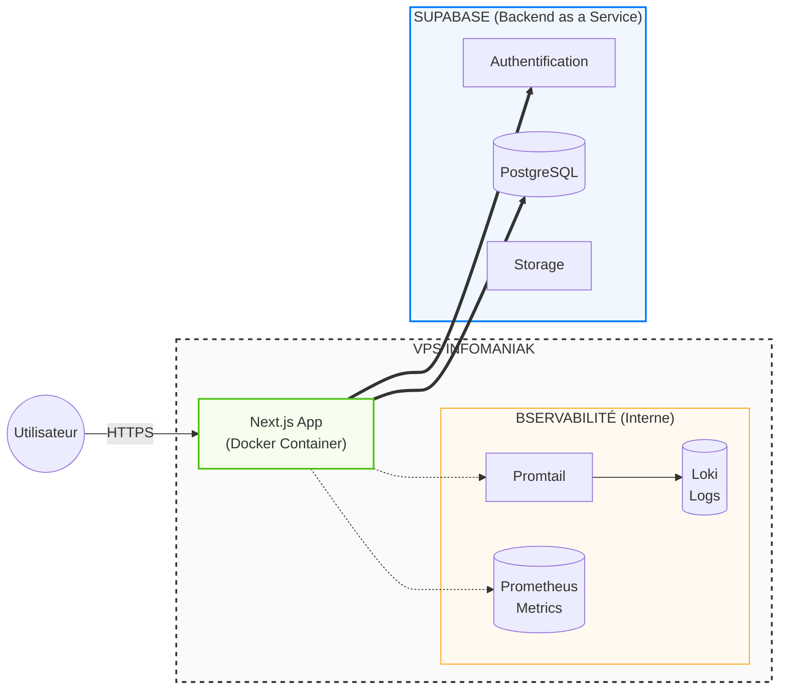

# Architecture & Infrastructur
 
Ce document détaille l'organisation technique du projet NOMOS, son infrastructure et son pipeline de déploiement continu.
 
## 1. Pipeline CI/CD
 
Le pipeline est déclenché à chaque push sur la branche `main` via GitHub Actions. Il assure la sécurité et la qualité du code avant toute mise en production.
 
[Voici le schéma de la pipeline](docs/evidence/ci-pipeline-success.png)
 
### Étapes détaillées :
 
**Phase 1 - Exécution parallèle :**
1. **Security Scan (Gitleaks + SCA)** : Détecte les secrets dans l'historique Git + Audit des dépendances de production
2. **SAST Analysis (CodeQL)** : Analyse statique approfondie pour détecter les vulnérabilités logiques (injections, XSS, etc.)
3. **Unit Tests (Jest)** : Exécution de la suite de tests avec génération de la couverture de code
 
**Phase 2 - Quality checks :**
4. **Lint & Type Check** : Vérifie la qualité du code avec ESLint et TypeScript (dépend de Security Scan)
5. **SonarQube** : Analyse la qualité globale et la couverture de code (dépend de Lint et Tests)
 
**Phase 3 - Build & Security :**
6. **Build & Scan Docker** : Construction de l'image Docker et scan des vulnérabilités avec Trivy + génération du SBOM (dépend de toutes les étapes précédentes)
 
**Phase 4 - Déploiement :**
7. **Deploy to VPS** : Déploiement automatique sur le VPS Infomaniak si toutes les étapes précédentes réussissent et si on est sur la branche `main`
 
## 2. Infrastructure
 
L'infrastructure repose sur un modèle hybride : une partie auto-hébergée sur un VPS (pour l'application et le monitoring) et une partie SaaS via Supabase (pour les données et l'authentification)
 
### Schéma de l'infrastructure
Attention ça pique un peu les yeux (mais on a essayé de généré un schéma clair)
 
